# Activity Diagram - Admin Change User Status

## Actor va tinh nang duoc chon

- **Actor:** Admin
- **Tinh nang:** Change User Status
- **Use Case:** UC-A04 - Change User Status
- **Mo ta ngan:** Admin thay doi trang thai tai khoan user sang `active`, `inactive`, hoac `banned`.

## Activity Diagram

```mermaid
%%{init: {"flowchart": {"curve": "stepBefore"}} }%%
flowchart LR
    start((Start)) --> A[Admin opens Admin Dashboard]
    A --> B[Open User Management Table]
    B --> C[Search / filter target user]
    C --> D[Select Change Status action]
    D --> E[Choose new status:<br/>active / inactive / banned]
    E --> F[Click Confirm]
    F --> G[Validate request]

    G --> H{{Check conditions}}

    H -->|Target user exists| C1[User exists]
    H -->|Admin is not changing own status| C2[Not self-update]
    H -->|New status is valid| C3[Status is valid]

    C1 --> J[All conditions are true]
    C2 --> J
    C3 --> J

    J --> K{{All conditions<br/>are true?}}

    K -->|Yes| L[Update user status<br/>in database]
    L --> M[Revoke active sessions<br/>if status is inactive or banned]
    M --> N[Write audit log:<br/>actor_id, action, old_value, new_value]
    N --> O[Show success message]
    O --> finish(((End)))

    K -->|No| P[Show validation / permission error]
    P --> Q[Return to User Management Table]
    Q --> C

    H -.->|One condition is false| P
```

## Luong chinh

1. Admin vao trang `/admin`.
2. Admin mo bang quan ly nguoi dung.
3. Admin tim user can thay doi status.
4. Admin chon hanh dong **Change Status**.
5. Admin chon status moi: `active`, `inactive`, hoac `banned`.
6. He thong validate cac dieu kien.
7. Neu tat ca dieu kien dung, he thong cap nhat status trong database.
8. Neu status moi la `inactive` hoac `banned`, he thong revoke cac session dang hoat dong cua user.
9. He thong ghi audit log.
10. He thong hien thi thong bao thanh cong.

## Luong ngoai le

- **Target user khong ton tai:** he thong hien thi loi va quay lai bang User Management.
- **Admin tu doi status cua chinh minh:** he thong tu choi voi loi permission.
- **Status moi khong hop le:** he thong hien thi loi validation.
